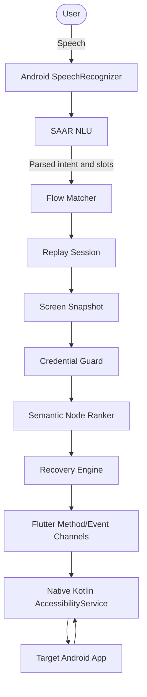

# SAAR - Smart Automated Action Replay

**Learn an Android task once. Replay it with your voice.**

SAAR is an on-device Android assistant that records a task performed by a user, converts the interaction trace into an abstract workflow, and replays that workflow with new parameters such as item, quantity, or address. The project is built for the Samsung PRISM GenAI Hackathon.

## Hackathon Submission

| Deliverable | Repository location |
|---|---|
| Source code | This repository (`lib/`, `android/`, `test/`) |
| Flutter dependency manifest | [`pubspec.yaml`](pubspec.yaml) |
| ML training requirements | [`requirements.txt`](requirements.txt) |
| Submission presentation | [`SRMIST_Unknowns_Submission_PPT.pdf`](SRMIST_Unknowns_Submission_PPT.pdf) |
| Demo video | [`Samsung Video.mp4`](Samsung%20Video.mp4) |
| Architecture and safety documentation | [`docs/`](docs/) |

---

## Table of Contents

- [What SAAR Does](#what-saar-does)
- [Features](#features)
- [Architecture](#architecture)
- [Repository Guide](#repository-guide)
- [Requirements](#requirements)
- [Setup](#setup)
- [Run and Build](#run-and-build)
- [First Demo Flow](#first-demo-flow)
- [Safety Model](#safety-model)
- [ML Pipeline](#ml-pipeline)
- [Testing](#testing)
- [FAQ](#faq)
- [Limitations](#limitations)

---

## What SAAR Does

```
┌──────────────┐     ┌──────────────┐     ┌──────────────┐
│  1. TEACH    │     │  2. LEARN    │     │  3. REPLAY   │
│              │     │              │     │              │
│ "Teach me to │────▶│ SAAR-NLU     │────▶│ "Order milk  │
│  order on    │     │ converts     │     │  from Zepto"  │
│  Zepto"      │     │ your taps    │     │              │
│              │     │ into abstract│     │ SAAR replays │
│ You perform  │     │ flow steps   │     │ with "milk"  │
│ the task     │     │ with roles   │     │ as the item  │
└──────────────┘     └──────────────┘     └──────────────┘
```

1. **Teach:** Speak a teaching command, switch to the target app, and perform the task normally. Android's Accessibility Service records taps, text entry, scrolling, and relevant UI state.
2. **Learn:** When teaching stops, the trace is normalized and compiled into a reusable flow described by semantic roles and parameterized slots.
3. **Replay:** Speak a new command. Local intent parsing and flow matching select the saved flow, extract slot values, semantically locate each target, and execute one step at a time.

The runtime is designed to work locally without an LLM API key or a production NLU HTTP request. It stops before password, OTP, payment, or other credential-sensitive interactions.

---

## Features

- Voice-triggered teaching and replay
 - One-shot workflow learning from a real demonstration
 - Semantic UI roles instead of fixed screen coordinates
 - Item, quantity, address, app, and other flow slots
 - Local intent classification and slot extraction
 - Exact and paraphrased flow matching
 - Popup dismissal, scrolling, retry, and back-navigation recovery
 - Clarification when a target is unavailable or multiple flows are ambiguous
 - Manual STOP kill-switch during replay
 - Flow library with saved-flow inspection and deletion
 - Session history and execution reports
 - Dual-layer, fail-closed credential protection in Dart and Kotlin

---

## Architecture



The state-aware replay loop is:

```text
screen snapshot -> safety check -> precondition -> semantic target -> action
-> wait for UI update -> new snapshot -> postcondition -> next step
```

The Flutter layer owns UI, state, local storage, NLU, flow compilation, matching, replay coordination, and reporting. The Kotlin layer captures the accessibility tree and dispatches supported gestures through `AccessibilityService`. `MethodChannel` and `EventChannel` connect the two layers.

## Repository Guide

```
SAAR/
├── android/                  Android project, manifest, Gradle files, and Kotlin bridge
├── assets/                   App images, vocabulary, and model metadata
├── docs/                     Architecture, safety, limitations, and PRISM test matrix
├── lib/                      Flutter entry point, models, services, and screens
├── ml/                       Dataset, training, evaluation, export, and ONNX model files
├── test/                     Dart model, service, and widget tests
├── PLAN.md                   Engineering audit and implementation plan
├── pubspec.yaml              Flutter and Dart dependencies
├── requirements.txt          Optional Python ML dependencies
├── SRMIST_Unknowns_Submission_PPT.pdf
├── Samsung Video.mp4
└── .env.example              Optional local environment template
```

## Requirements

### Runtime and Android build

- Flutter 3.x and Dart SDK compatible with `pubspec.yaml` (`^3.13.4`)
- Android SDK API 24 or newer
- Android Studio or an Android SDK with Gradle support
- Physical Android device recommended; Accessibility Service behavior varies by emulator and manufacturer
- Microphone and Accessibility permissions

### Optional ML development

Python dependencies for dataset generation, training, ONNX export, and quantization are listed in [`requirements.txt`](requirements.txt). The Flutter app does not use it to install runtime dependencies; use `pubspec.yaml` for that.

## Setup

```bash
git clone https://github.com/Lesgo-HQ/PRISM_GENAI_HACKATHON_Y2026.git
cd SAAR
```

```bash
flutter pub get
flutter analyze
```

For the optional ML workflow:

```bash
python -m venv .venv
# Windows PowerShell
.\.venv\Scripts\Activate.ps1
python -m pip install -r requirements.txt
```

Do not commit `.env` or API keys. The committed `.env.example` is only a configuration reference.

## Run and Build

```bash
flutter devices
flutter run
flutter build apk --debug
flutter build apk --release
```

After launching, enable SAAR under Android Settings > Accessibility. Allow microphone access when the app first starts speech recognition.

## First Demo Flow

1. Open SAAR and enable its Accessibility Service.
2. Tap the microphone and say, **"Teach me to search on Amazon."**
3. Switch to the target app and perform a search, such as `headphones`.
4. Return to SAAR and tap **Stop & Save**.
5. Speak **"Search for wireless earbuds on Amazon."** to replay with a changed item.
6. Try a changed quantity or address where the saved flow exposes those slots.
7. Navigate to a password or payment screen and verify that the credential guard stops execution.

The full PRISM scenario list is in [`docs/prism-test-matrix.md`](docs/prism-test-matrix.md). T1-T14 entries currently require physical-device verification and must not be treated as evidence until observed and recorded.

## Safety Model

- The Dart credential guard runs before an action is sent to native code.
- The Kotlin guard runs again before gesture dispatch.
- Password, OTP, payment, and credential-like fields are never read, entered, or replayed.
- The user can stop an active replay with the STOP control.
- Unknown intents, low-confidence matches, ambiguous flows, and unrecoverable states clarify or stop rather than guess.

See [`docs/safety.md`](docs/safety.md) for the detailed safety rules.

## ML Pipeline

The `ml/` directory is optional for contributors working on the local NLU model:

```bash
python ml/dataset/generate.py
python ml/dataset/validate.py
python ml/training/train.py
python ml/training/evaluate.py
python ml/training/export_onnx.py
python ml/training/quantize.py
```

The checked-in `ml/models/saar_nlu.onnx` and metadata assets support local model experimentation. The deterministic local intent and slot pipeline remains the fallback path when a trained model is unavailable.

## Testing

```bash
flutter analyze
flutter test
```

The test suite includes model, service, and widget coverage. Accessibility behavior, speech recognition, permissions, cross-app grounding, and the T1-T14 matrix require an Android device and cannot be fully verified by host-side unit tests alone.

## FAQ

### Does SAAR require an API key?

No. Normal runtime operation is intended to use local NLU and local storage. Never commit credentials. The repository's `.env.example` is not a secret store.

### Why is `requirements.txt` separate from `pubspec.yaml`?

`pubspec.yaml` installs Flutter application dependencies. `requirements.txt` is only for the optional Python ML dataset and model workflow.

### Where are the presentation and demo?

They are checked into the repository as [`SRMIST_Unknowns_Submission_PPT.pdf`](SRMIST_Unknowns_Submission_PPT.pdf) and [`Samsung Video.mp4`](Samsung%20Video.mp4). If a submission portal rejects the MP4 size, host it on YouTube or Google Drive and add that URL to the Hackathon Submission table.

### What does the required tag mean?

`PRISM_GENAI_HACKATHON_Y2026` is the submission tag and should point to the exact commit submitted for judging.

### What apps and tasks are supported?

The current focus is generic navigation and e-commerce-style flows. Cross-app generalization is an architectural goal and must be demonstrated on-device before being claimed as verified.

---

## Limitations

- NLU quality is limited by the current local model and regex/keyword fallback.
- Cross-app generalization is not yet fully proven across real applications.
- Android speech recognition may require network connectivity depending on the device and OS.
- There is no persistent floating overlay for pause/resume.
- Noisy or unnecessary teaching actions can reduce flow quality.
- The current ontology is focused on e-commerce and generic navigation.
- The supported language is English.
- Accessibility behavior differs across Android versions, OEM skins, and target apps.

See [`docs/limitations.md`](docs/limitations.md) and [`PLAN.md`](PLAN.md) for the full audit and remaining work.