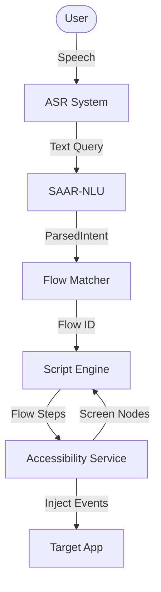

# SAAR — Smart Automated Action Replay

**Learn any Android task once. Replay it with your voice.**

SAAR is an on-device Android assistant that watches you perform a task once (like ordering groceries), learns the abstract workflow, and replays it whenever you ask — with different items, quantities, or addresses — all via voice command.

Built with Flutter + native Kotlin for a hackathon. 

---

## Table of Contents

- [How It Works](#how-it-works)
- [Features](#features)
- [Tech Stack](#tech-stack)
- [Project Structure](#project-structure)
- [Setup & Installation](#setup--installation)
- [Running the App](#running-the-app)
- [Granting Permissions](#granting-permissions)
- [Testing Your First Flow](#testing-your-first-flow)
- [Architecture](#architecture)
- [Flow JSON Schema](#flow-json-schema)
- [Credential Guard](#credential-guard)
- [Role Ontology](#role-ontology)
- [Configuration](#configuration)
- [Known Limitations](#known-limitations)
- [License](#license)

---

## How It Works

```
┌──────────────┐     ┌──────────────┐     ┌──────────────┐
│  1. TEACH    │     │  2. LEARN    │     │  3. REPLAY   │
│              │     │              │     │              │
│ "Teach me to │────▶│ SAAR-NLU     │────▶│ "Order milk  │
│  order on    │     │ converts     │     │  from Zepto"  │
│  Zepto"      │     │ your taps    │     │              │
│              │     │ into abstract│     │ SAAR replays │
│ You perform  │     │ flow steps   │     │ with "milk"  │
│ the task     │     │ with roles   │     │ as the item  │
└──────────────┘     └──────────────┘     └──────────────┘
```

1. **Teach** — Tap the mic, say "teach me to order on Zepto", then switch to Zepto and perform the task normally. SAAR records every tap, type, and scroll via Android's Accessibility Service.
2. **Learn** — When you tap "Stop & Save", the raw action trace is abstracted into a generalised flow with parametrised slots (item name, quantity, address) entirely on-device.
3. **Replay** — Next time, say "order 2 kg rice from Zepto". SAAR matches the utterance to the learned flow using its local NLU, fills in the slots, and executes step-by-step — stopping automatically before any payment/credential screen.

---

## Features

| Feature | Status |
|---------|--------|
| Voice-triggered teach & command | ✅ |
| One-shot learning from demonstration | ✅ |
| Abstract flows over element roles (not coordinates) | ✅ |
| Parametrised slots (item, quantity, address) | ✅ |
| Local Intent classification | ✅ |
| Paraphrase handling ("buy groceries" = "order food") | ✅ |
| **Fail-closed credential guard** (dual Kotlin + Dart) | ✅ |
| Popup/dialog auto-dismiss during replay | ✅ |
| Scroll-to-find target elements | ✅ |
| Ask-when-stuck clarification dialogs | ✅ |
| Noise filtering during teach (system UI, duplicates) | ✅ |
| Manual STOP kill-switch during execution | ✅ |
| Flow library — view, expand, delete saved flows | ✅ |
| Session logging (teach & replay history) | ✅ |

---

## Tech Stack

| Layer | Technology |
|-------|-----------|
| UI & app logic | Flutter 3.x (Dart), Material 3 |
| State management | Provider (`ChangeNotifier`) |
| Screen automation | Native Kotlin `AccessibilityService` |
| Flutter ↔ Kotlin bridge | `MethodChannel` + `EventChannel` |
| On-device ASR | `speech_to_text` plugin |
| Local NLU Pipeline | `SAAR-NLU` (Regex baseline / Future ONNX) |
| Local storage | `sqflite` (flows + session logs) |

---

## Project Structure

```
SAAR/
├── pubspec.yaml                                  # Flutter dependencies
├── README.md                                     # This file
│
├── android/
│   └── app/src/main/
│       ├── AndroidManifest.xml                   # Permissions + service declaration
│       ├── res/xml/
│       │   └── accessibility_service_config.xml  # Accessibility service config
│       └── kotlin/com/lesgo/saar/
│           ├── SaarAccessibilityService.kt       # UI tree capture, gestures, credential guard
│           └── MainActivity.kt                   # MethodChannel + EventChannel bridge
│
├── lib/
│   ├── main.dart                                 # Entry point, Provider
│   ├── app_controller.dart                       # Central state machine
│   │
│   ├── models/
│   │   ├── flow.dart                             # Flow, FlowStep, Slot
│   │   ├── ui_node.dart                          # Accessibility tree node
│   │   ├── action_trace_event.dart               # Teach-session event
│   │   └── role_ontology.dart                    # UI roles + heuristic matcher
│   │
│   ├── services/
│   │   ├── accessibility_bridge.dart             # Typed wrapper over native channels
│   │   ├── asr_service.dart                      # Speech-to-text push-to-talk
│   │   ├── flow_store.dart                       # SQLite CRUD
│   │   ├── flow_matcher.dart                     # Flow matching logic
│   │   ├── flow_synthesizer.dart                 # Action trace → abstract flow
│   │   ├── replay_engine.dart                    # Step executor with guard + adaptation
│   │   ├── credential_guard.dart                 # Fail-closed sensitive field check
│   │   └── saar_nlu.dart                         # On-device natural language understanding
│   │
│   └── screens/
│       ├── home_screen.dart                      # Mic button, status, flow list
│       ├── teach_screen.dart                     # Recording indicator, Stop & Save
│       ├── replay_screen.dart                    # Step progress, STOP button, clarification
│       ├── flow_library_screen.dart              # List / expand / delete flows
│       ├── report_screen.dart                    # Execution reports UI
│       └── settings_screen.dart                  # Accessibility toggle
│
└── test/
    └── models_test.dart
    └── services_test.dart
```

---

## Setup & Installation

### Prerequisites

- **Flutter** 3.13+ with Dart 3.13+
- **Android SDK** (API level 24+ / Android 7.0+)
- **Android device or emulator** with Accessibility support

### Step 1 — Clone

```bash
git clone https://github.com/Lesgo-HQ/SAAR.git
cd SAAR
```

### Step 2 — Install Dependencies

```bash
flutter pub get
```

### Step 3 — Verify

```bash
flutter analyze
```

---

## Running the App

### On a physical device (recommended)

```bash
flutter run
```

### Build an APK

```bash
# Debug APK (faster build, larger size)
flutter build apk --debug

# Release APK
flutter build apk --release
```

---

## Granting Permissions

### 1. Accessibility Service (required)
1. Launch SAAR → you'll see a **red banner**: *"Accessibility service disabled"*
2. Tap **ENABLE**
3. Toggle **ON** and tap **Allow** on the confirmation dialog
4. Return to SAAR — the banner should disappear and the status shows green

### 2. Microphone (auto-prompted)
The first time you tap the mic button, Android will prompt for microphone permission. Tap **Allow**.

---

## Testing Your First Flow

#### Phase 1 — Teach a Flow

1. Open SAAR
2. Tap the **mic button** 🎤
3. Say: **"teach me to search on Amazon"**
4. SAAR will show "Recording your actions..." and switch you to teach mode
5. **Switch to Amazon**
6. Perform the task: tap the search bar → type "headphones" → tap search → tap a result
7. **Switch back to SAAR**
8. Tap the red **Stop & Save** button

#### Phase 2 — Replay with Different Parameters

1. Tap the **mic button** 🎤
2. Say: **"search for wireless earbuds on Amazon"**
3. SAAR will match your utterance to the learned flow, fill slots, and execute step-by-step.

#### Phase 3 — Test the Credential Guard

1. Navigate to any app's login page (with a password field visible)
2. Try to replay a flow — SAAR will **immediately halt** with a safety message.

---

## Architecture

### System Overview

SAAR operates entirely on-device with zero cloud dependencies at runtime, ensuring maximal privacy and security.



---

## Credential Guard

The credential guard runs as a **dual-layer, deterministic, fail-closed** check before every single dispatched action.

- Runs in Dart before calling the bridge.
- Runs natively in Kotlin before gesture dispatch.

---

## Known Limitations

1. **Regex-based NLU Baseline**: The current NLU is based on regex (`saar-nlu-lite`). It is not a trained neural model.
2. **Generalization**: Cross-app generalization is currently an architectural design rather than a physically demonstrated capability.
3. **ASR Network Dependency**: ASR relies on Android's native `SpeechRecognizer`, which may require network.
4. **No Overlay UI**: Currently, there is no floating overlay UI to pause/resume.
5. **Trace Quality**: Flow synthesis quality relies heavily on clean action traces during teaching.
6. **Domain Restriction**: Largely limited to e-commerce patterns currently.

---

## License

Built for hackathon use. See repository for license details.
