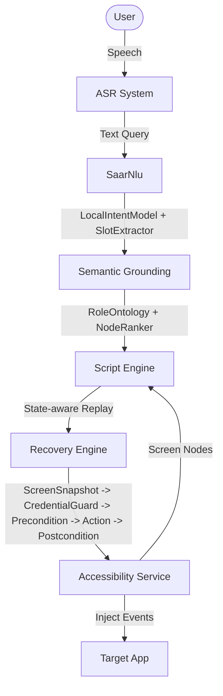

# SAAR Architecture

## System Overview

SAAR (Samsung Accessibility Automation Runtime) is a system for recording and replaying user interactions on Android.
All components operate entirely on-device with zero cloud dependencies at runtime, ensuring maximal privacy and security.

### Data Flow Diagram

## Modules

### NLU Pipeline
- **ASR**: Uses native Android SpeechRecognizer.
- **SaarNlu**: The on-device natural language understanding engine. It uses a `LocalIntentModel` and `SlotExtractor` to parse text purely locally, converting spoken queries into executable parameters.

### Semantic Grounding Pipeline
- Uses `RoleOntology` to map abstract flow intents to generic UI roles (e.g., search fields, buttons).
- A `NodeRanker` evaluates the UI hierarchy (ScreenSnapshot) to assign match scores, selecting the optimal node for interaction regardless of precise coordinates.

### State-Aware Replay Pipeline
- **ScreenSnapshot**: Captures the current DOM state before any action.
- **CredentialGuard**: Inspects nodes to prevent sensitive data interaction.
- **Precondition**: Verifies the UI is in the expected state before proceeding.
- **Action**: Executes the accessibility event (tap, scroll, etc.).
- **Postcondition**: Validates that the action succeeded by checking the subsequent state.

### Recovery Engine
- If a step fails, the Recovery Engine automatically attempts heuristical corrections:
  - Dismissing safe popups.
  - Scrolling vertically (up/down).
  - Executing back presses if trapped in sub-menus.

### Execution Reporting Pipeline
- Compiles the success, failures, and recoveries of the flow into a final report. The report logs all steps executed and any clarifications requested from the user.

## Native Bridge Protocol
Communication between Flutter and the Accessibility service occurs via MethodChannels:
- `startRecording()` / `stopRecording()`
- `replayFlow(flowData)`
- `stopReplay()`
- `onNodeClicked(nodeData)` (Event channel)
- `onScreenChanged(rootNode)` (Event channel)

## No Runtime Cloud Dependency
SAAR is designed to function strictly on-device. The current NLU uses local intent extraction without external LLM APIs, ensuring complete privacy.
